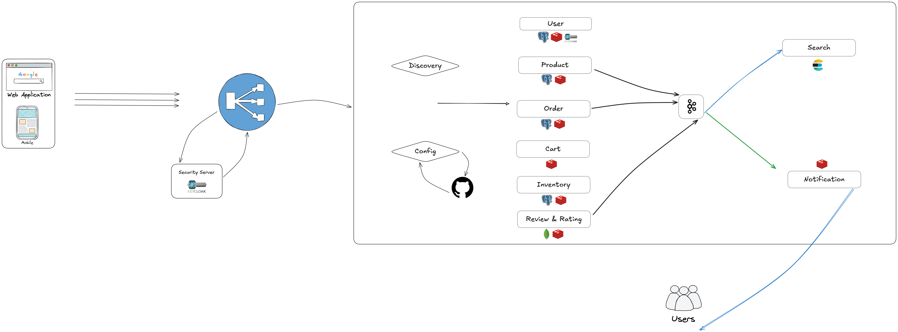

## E-Commerce Microservice System

Масштабируемая микросервисная e-commerce платформа с использованием **Java + Spring Boot**, построенная по **event-driven архитектуре** с Kafka, Redis, MongoDB, Elasticsearch, Prometheus и Keycloak.



---

### Основной стек технологий

* **Java 17, Spring Boot 3**
* **Spring Cloud (Eureka, Config, Gateway, Sleuth)**
* **Keycloak** (OAuth2 / JWT security)
* **PostgreSQL**, **MongoDB**, **Redis**
* **Elasticsearch** (поиск)
* **Apache Kafka** (event-based коммуникация)
* **Docker**, **Prometheus**, **Grafana**, **OpenTelemetry**
* **Swagger/OpenAPI**, **Actuator**, **Resilience4J**

---

## Структура микросервисов

| Микросервис            | Назначение                                                                       |
| ---------------------- | -------------------------------------------------------------------------------- |
| `user-service`         | Пользователи, профили, роли (PostgreSQL + Redis + Keycloak)                      |
| `product-service`      | CRUD продуктов, поиск, фильтрация (PostgreSQL + MongoDB + Redis + Elasticsearch) |
| `order-service`        | Оформление и управление заказами (PostgreSQL + Redis + Kafka)                    |
| `cart-service`         | Управление корзиной (Redis)                                                      |
| `inventory-service`    | Учёт и резервирование товаров (PostgreSQL + Redis + Kafka)                       |
| `review-service`       | Отзывы и рейтинги (MongoDB + Redis + Elasticsearch)                              |
| `notification-service` | Отправка и кэширование уведомлений (Kafka + Redis)                               |
| `search-service`       | Индексация и полнотекстовый поиск по продуктам и отзывам                         |
| `gatewayserver`        | API Gateway с фильтрами и маршрутизацией (Spring Cloud Gateway + Resilience4J)   |
| `config-server`        | Централизованная конфигурация (Spring Config + Git)                              |
| `eureka-server`        | Service Discovery (Spring Eureka)                                                |

---

## Аутентификация

Используется **Keycloak** как Identity Provider.

* `/auth/login`, `/auth/register` → через API Gateway
* Проверка JWT происходит в Gateway
* Доступы:

    * `ADMIN` — админ-эндпоинты
    * `USER` — обычный пользователь
    * Защита на уровне Gateway

---

## Асинхронная коммуникация (Kafka)

| Producer        | Consumer(s)                  | Event                                             |
| --------------- |------------------------------|---------------------------------------------------|
| order-service   | search-service, notification | order-created, updated, deleted                   |
| review-service  | search-service               | review-added, deleted                             |
| product-service | search-service               | product-created, updated, deleted, status-changed |

---

## Мониторинг и трассировка

* **Actuator** — `/actuator/health`, `/actuator/metrics`
* **Prometheus + Grafana** — мониторинг состояния
* **Spring Cloud Sleuth + OpenTelemetry** — трассировка запросов
* **Elasticsearch + Logstash** — логирование

---

## Как запустить

### Docker (в разработке)

> В будущем `docker-compose.yml` для всех сервисов + баз + Kafka

### Локальный запуск (dev)

1. Склонируй репозиторий:

   ```bash
   git clone https://github.com/daurenassanbaev/e-commerce-server.git
   cd e-commerce-server
   ```

2. Запусти в порядке:

    * `config-server`
    * `eureka-server`
    * `gatewayserver`
    * Все остальные сервисы

3. Запусти базу данных: PostgreSQL, MongoDB, Redis, Kafka

4. Конфигурации читаются из [config-repo](https://github.com/daurenassanbaev/e-commerce-config)

---

## Документация API

Swagger UI доступен по адресу:

```
http://localhost:{port}/swagger-ui.html
```

Открывается для каждого микросервиса индивидуально.